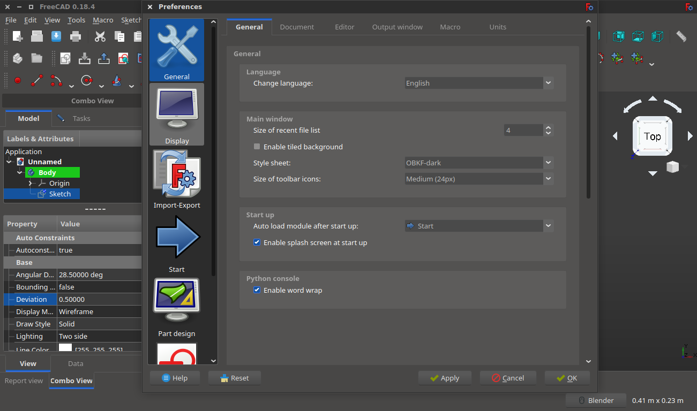

About
-------
version 0.1

QT themes (stylesheet) specially developed for **FreeCAD** (http://www.freecadweb.org/).
They might work with other software that uses QT styling.

Dark style example:

Installation
------
**If you use FreeCAD 0.16 or higher you don't need to download the stylesheets, they are bundled with official release**.

In case you want to manually install them do the following:

1. Place the downloaded .qss files and /images/ folder in the path that fits your OS:
  - **OSX** = /Users/[YOUR_USER_NAME]/Library/Preferences/FreeCAD/Gui/Stylesheets/
  - **WINDOWS** = C:/[INSTALLATION_PATH]/FreeCAD/data/Gui/Stylesheets/
  - **LINUX** = /home/[YOUR_USER_NAME]/.FreeCAD/Gui/Stylesheets/

2. Only if you are using FreeCAD 0.15 or lower: images used in the theme need full paths to be found by FreeCAD, so you should search the string **qss:images** and replace with the real path of your computer. It should be done with all the .qss files you want to install-use
    - **find** = qss:images
    - **replace** = /Users/myName/Library/Preferences/FreeCAD/Gui/Stylesheets/images

Tested on FreeCAD 0.18.4

Known bugs and TO DOs
------
Please, follow the [Original link to get updated information](http://forum.freecadweb.org/viewtopic.php?f=10&t=14690)
And [This theme's specific link](http://forum.freecadweb.org/viewtopic.php?f=10&t=)

Credit
------
 by Pablo Gil Fernández.

License
------
Copyright (c) 2020 Oussama BOUKHELF.

This work is licensed under a [Creative Commons Attribution-ShareAlike 4.0 International License](http://creativecommons.org/licenses/by-sa/4.0/).
